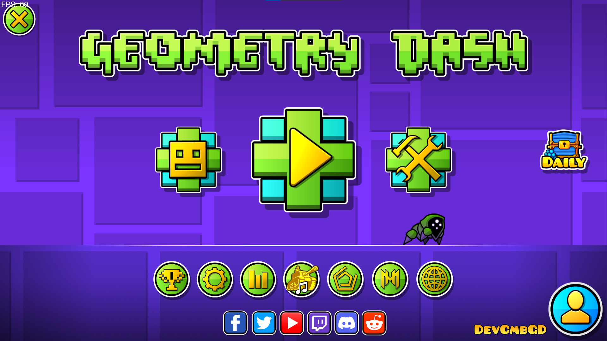
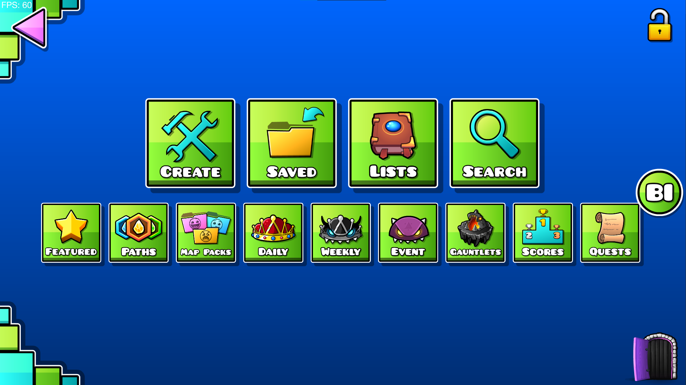
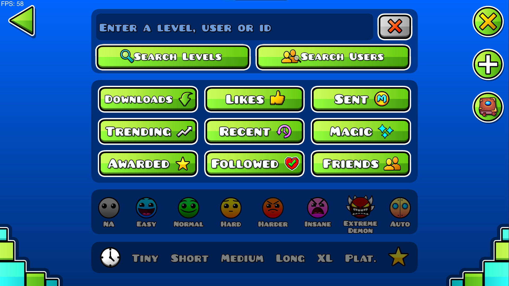
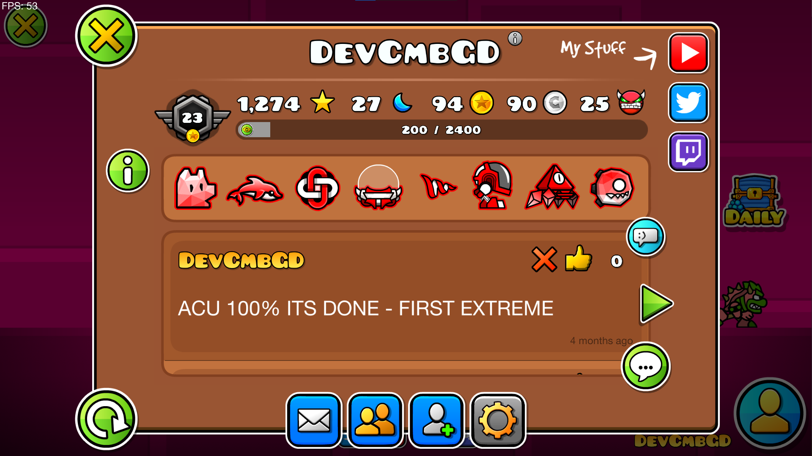

# Clean Menu
A geode mod that changes around the positioning of some stuff on the gd menus.

## Features
The main purpose of the mod is to re-organize certain things on the different menus, but mainly the main menu and create menu

### Main Menu

The main menu has some tweaks that make it look a bit cleaner, such as by positioning the social icons below the set of large buttons. Along with this, you can optionally hide the robtop logo and the more games button. Finally, the profile button has been moved to the bottom right corner with the name along the bottom.

### Creator Menu

All the un-necessary buttons have been removed and all the other ones have been split into two groups, focused and unfocused. Focused buttons are the create, saved, lists, and search buttons, and the unfocused ones are everyhing else. The focused buttons are displayed at the top with larger scaling, while the unfocused buttons are beneath them with small scaling.

### Search Menu

The search menu has barely been changed, but the buttons to search levels and users have been converted from small ones to large ones for easier usage

### Profile Menu

The profile menu has also barely changed, but the buttons along the bottom have been put into a row, and the comment and view comments button have been moved to the user posts box.